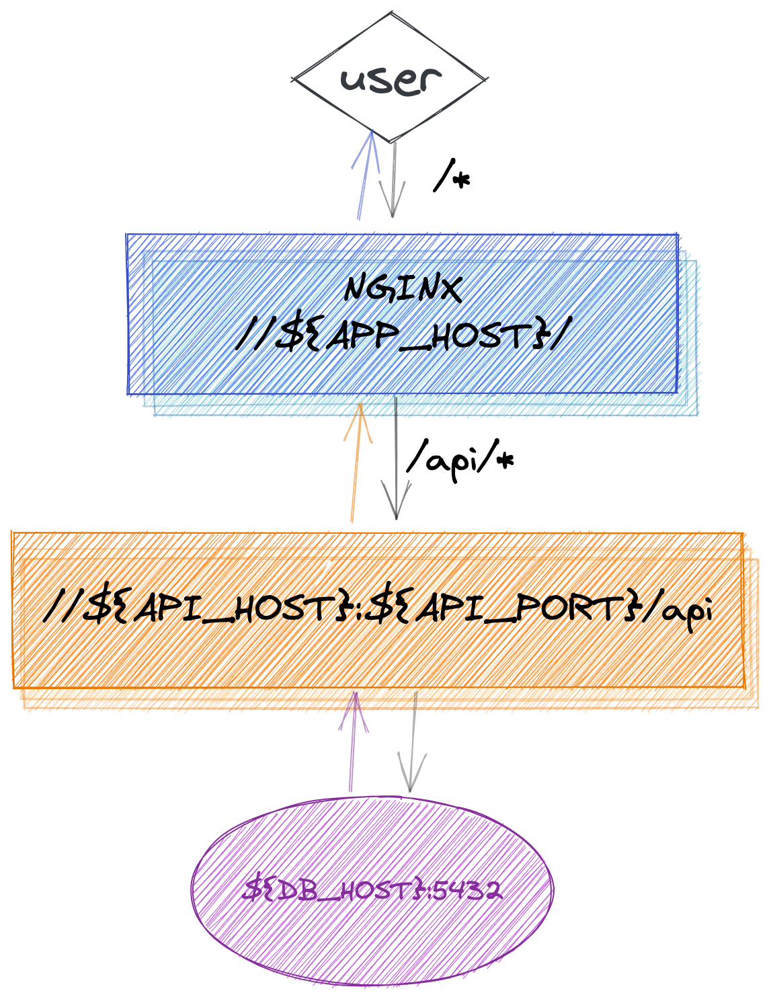
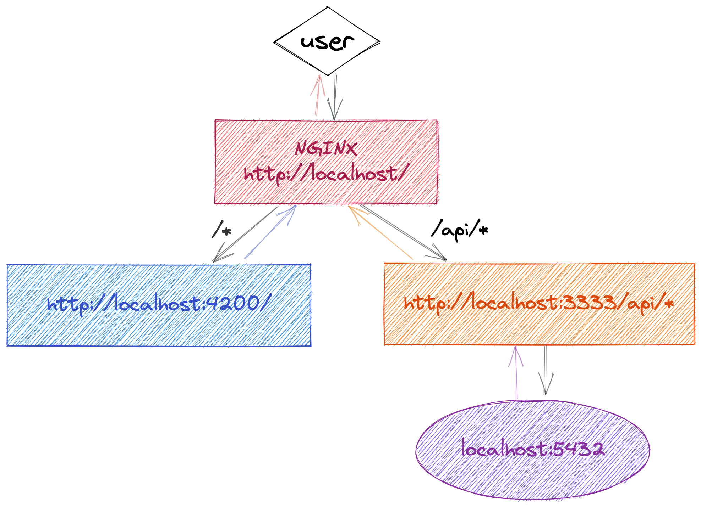

# JUSTT

## Quick start

For quick start, run

```bash
# copy project environment variables and spin up
cp .env.example .env && docker-compose up
```

and visit `http://localhost/`

To make it more bullet-proof during
development process, use following command instead:

```bash
docker-compose up --remove-orphans --build
```

The `--remove-orphans` is here to prevent sibling projects with same
name and services from interfering with each other (not likely to happen but
hey, we love bullet-proof solutions don't we).

The `--build` flag makes sure docker images are re-built and are
up-to-date (should be fast assuming docker layers are cached by default).

## Advanced usage

For more control over the deployment, keep on reading.

### Architecture

In it's simplest form (which is expected to be used in production), project
consists of an NGINX webserver, APP (front end business logic), API (back end business logic)
and a DB. Each piece can be scaled both vertically and horizontally:



## Development

While it's great to keep things simple, development environment requires more
pieces in order to dynamically respond to code modifications:



### docker-composer cluster

As mentioned in **Quick Start**, the easiest way to set up development
environment is to run:

```bash
docker-compose up --remove-orphans --build
```

however, it's not the only way to spin up the project...

### run docker images manually

In order to have full control over cluster setup, you could build each docker
image separately and orchestrate them anyway you see fit. Please find the
instructions below on how to build and run each docker image separately.

- First, make sure to have environment variables in place

  ```bash
  cp .env.example .env
  ```

- Build

  ```bash
  DOCKER_BUILDKIT=1 docker build -t justt/api -f apps/api/Dockerfile .
  # Pay attention we're targetting builder stage specifically! All we need here
  # is `npm install` so that we could run `npm run serve:web` to develop the
  # app rather than having nginx serving static dist/ folder
  DOCKER_BUILDKI=1 docker build --target builder -t justt/app -f apps/front-website/Dockerfile .
  ```

- Finally, run all the things:

  ```bash
  # DB
  docker run -it --rm -e POSTGRES_DB=prisma -e POSTGRES_USER=prisma \
  -e POSTGRES_PASSWORD=prisma -p 5432:5432 --name=justt-db \
  --mount type=bind,source="$(pwd)/tmp/postgres",destination=/var/lib/postgresql/data postgres:14-alpine

  # API - please notice we're loading environment variables from .env and then we overwrite the DB_HOST value - it's required unless both api and db are on same network - I prefer to create less stuff so I'm fine with this overwrite vs network setup. Oh and it will only work on OS X and Linux, Windows has some other resolvable hostname, please check docs
  docker run -it --rm --env-file .env -e DB_HOST=host.docker.internal -p 3333:3333 --name justt-api justt/api

  # APP
  docker run -it --rm -p 4200:4200 --name justt-app justt/app npm run serve:web

  # NGINX webserver
  docker run -it --rm -e APP_HOST=host.docker.internal -e APP_PORT=4200 \
   -e API_HOST=host.docker.internal -e API_PORT=3333 -p 80:80 --name=justt-web \
   --mount type=bind,source="$(pwd)/nginx.conf.dev.template,destination=/etc/nginx/templates/default.conf.template" nginx:1.19.2

  ```

### docker-less

In order to run NodeJS part of application directly
from your host machine, perform following steps:

- Make sure you have DB and Nginx, for example you could use existing configuration

  ```bash
  docker-compose up webserver postgres --remove-orphans --build
  ```

- Install NPM dependencies and run development servers:

  ```bash
  npm install && npm run serve:all
  ```

## On premise Production

Regardless to which deployment method you choose for on premise production, you'd probably need to build optimized docker images. For optimized docker images you'd need to:

- make sure to setup DB and fill in production values in `.env` file

- Build and run API:

  ```bash
  DOCKER_BUILDKI=1 docker build -t justt/api -f apps/api/Dockerfile .
  docker run -it --rm --env-file .env -p 443:443 --name justt-api justt/api
  ```

- Build and run app (with nginx built-in):

  ```bash
  DOCKER_BUILDKI=1 docker build -t justt/web -f apps/front-website/Dockerfile .
  docker run -it --rm -p 443:443 -e API_HOST={YOUR API DOMAIN NAME} -e API_PORT=443 --name justt-web justt/web
  ```

## Managed production

Yay! Check out https://render.com/ and out of the box working [cluster
configuration](./render.yaml) of this project ([LIVE DEMO](https://justt.sergeylukin.com/)).
